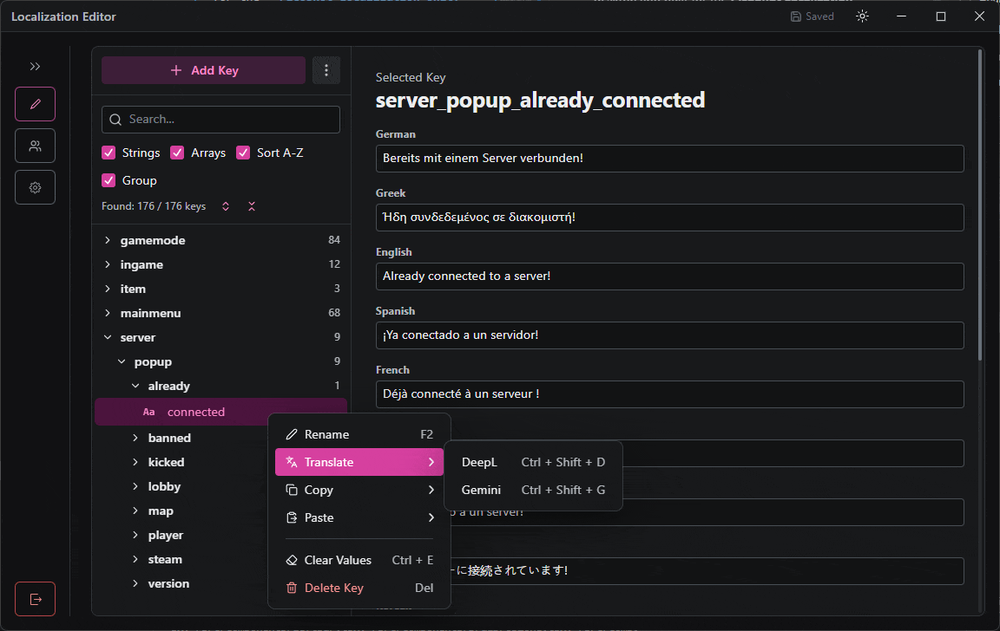

# PicoShot Localization UI

  

A modern, fast, and collaborative localization editor desktop app built for the **PicoShot Localization Unity System**.

## Features

- **Drag & Drop Workflow**: Easily manage game translation `.bloc` files or whole directories by simply dragging them into the app.
- **AI-Powered Translations**: Integrated auto-translation utilizing **DeepL** and **Google Gemini** for lightning-fast localized content.
- **Real-time Collaboration**: Host and join live sessions with a simple 6-character code. Edit localizations with your team simultaneously!
- **Cross-Platform**: Built on top of Tauri v2, bringing near-native performance to Windows, macOS, and Linux.
- **Modern UI**: Polished, accessible interface powered by Radix UI Themes and Tailwind CSS v4.

## Tech Stack

- **Framework**: [Tauri v2](https://v2.tauri.app/), [React 19](https://react.dev/), [Vite](https://vitejs.dev/)
- **State Management**: [Zustand](https://zustand-demo.pmnd.rs/)
- **Styling**: [Tailwind CSS v4](https://tailwindcss.com/), [Radix UI Themes](https://www.radix-ui.com/)
- **Icons**: [Lucide React](https://lucide.dev/)

## Live Sessions

Working with a team?

1. Open the app and create a new session.
2. Share the generated **6-character Session Code** with your teammates.
3. Teammates enter their **Display Name** and the **Session Code** on the main menu to join.
4. Watch changes sync instantaneously between everyone connected!

---

_Designed for seamless game localization._
